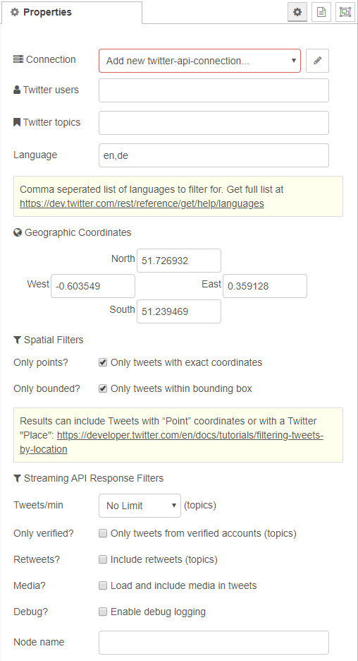

# node-red-contrib-twitter-stream
Node-red node for querying the Twitter streaming API.

Further information on the parameters for filtering real-time tweets can be found in the documentation:
- [Standard streaming API request parameters](https://developer.twitter.com/en/docs/tweets/filter-realtime/guides/basic-stream-parameters)
- [Filtering Tweets by location](https://developer.twitter.com/en/docs/tutorials/filtering-tweets-by-location)

Be aware of the [Geo Guidelines](https://developer.twitter.com/en/developer-terms/geo-guidelines) provided by Twitter for developers.

## Features
Connect to the Twitter streaming API and...
- Get tweets of specific users (follow)
- Get tweets of specific topics (track)
- Get tweets for a specific region described by a geographic bounding box (locations)
 
## Configuration
- Get a Twitter dev account from https://dev.twitter.com
- Create a Twitter App on https://apps.twitter.com
- Choose Twitter users / hashtags or random search strings
- Alternatively provide latitude and longitude coordinates describing the North, West, East and South extents of a geographic bounding box.

## Further Development 
If you are interested in suggesting enhancements please raise an issue for review via [GitHub](https://github.com/virtualarchitectures/node-red-contrib-twitter-stream-location). 
